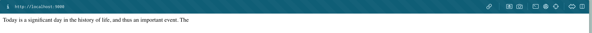
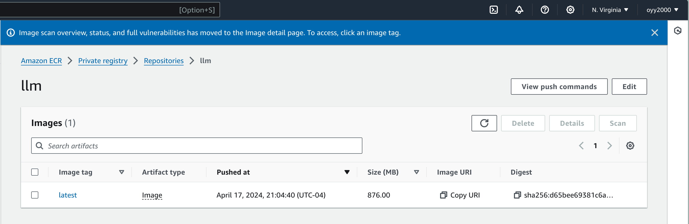
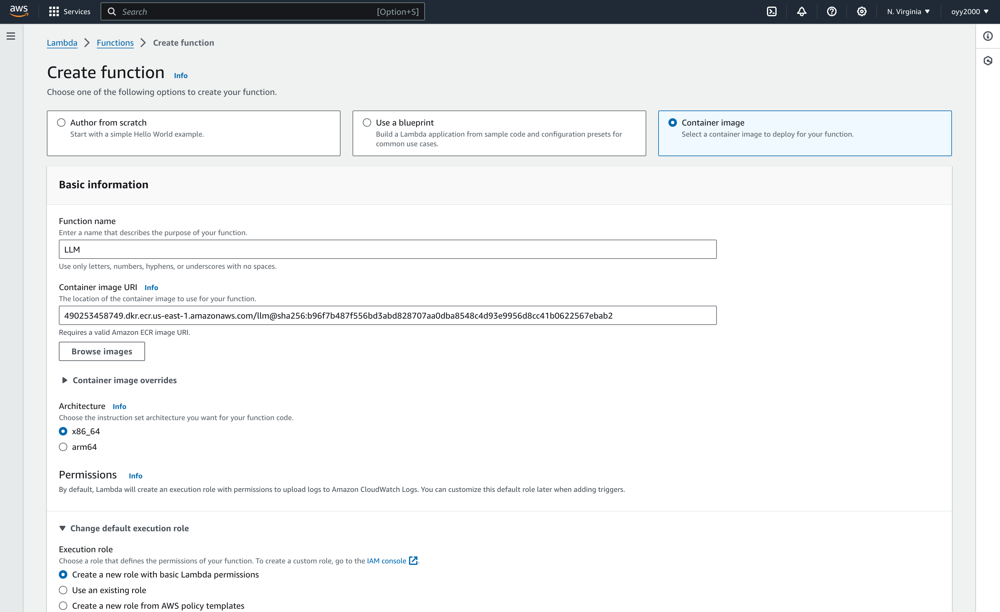

# mini_project10_transformer_endpoint

Rust Serverless Transformer Endpoint

## Goals
- Dockerfile and Rust code
- Screenshot of AWS Lambda
- cURL request against endpoint

## Step 1: Setup

1. Initializing new AWS Lambda project in Rust using command line `cargo lambda new <PROJECT_NAME>` in terminal.
2. Using llm crate in Cargo.toml file.
3. Add functional implementations and inference endpoint in main.rs file.
4. Then run the demo with `cargo lambda watch` and test locally.


## Step 2: Dockerize and Elastic Container Registry (ECR)

1. Naviagte into ECR under AWS console and create a new private repository.
2. Login to AWS ECR by `aws ecr get-login-password --region us-east-1 | docker login --username AWS --password-stdin <AWS-ACCOUNT-NUMBER>.dkr.ecr.us-east-1.amazonaws.com`
3. Build the docker image by `docker buildx build --progress=plain --platform linux/arm64 -t llm .` with the Dockerfile.
4. Tag the image by `docker tag llm:latest <AWS-ACCOUNT-NUMBER>.dkr.ecr.us-east-1.amazonaws.com/llm:latest`
5. Finally, push the image to the ECR repository we just created by `docker push <AWS-ACCOUNT-NUMBER>.dkr.ecr.us-east-1.amazonaws.com/llm:latest`


## Step 3: AWS Lambda

1. Navigate into Lambda under AWS console.
2. Create a new function with the option Container image, enter the Amazon ECR image URL, and choose arm64 architecture.
    3. 
3. Then, click into your lambda function, and under configuration, navigate into the General configuration, and adjust the Memory and timeout setting based on the characteristics of your LLM.
Then, click into the functional URL, create a new function URL with CORS enabled.
4. use cURL request against endpoint
    ```
    curl -X POST  https://jt3stdefryzlfovjem33kb4zpa0ngivf.lambda-url.us-east-1.on.aws/ -H "Content-Type: application/json" -d '{"text":"Today is a"}'
    ```
